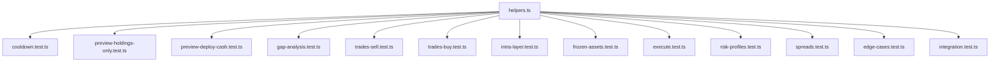

# Rebalance Test Suite - Comprehensive Report

**Date:** 2026-01-29
**Test Framework:** Vitest
**Total Tests:** 149
**Total Lines of Code:** 4,598
**Status:** All Tests Passing ✓

---

## Executive Summary

This report documents the comprehensive test suite for the Blu Markets rebalancing system. The suite validates the core portfolio rebalancing functionality including inter-layer allocation, intra-layer asset distribution, frozen asset handling, transaction cost calculations, and edge case scenarios.

### Key Metrics

| Metric | Value |
|--------|-------|
| Test Files | 13 |
| Total Tests | 149 |
| Helper Functions | 32 |
| Lines of Test Code | 4,598 |
| Pass Rate | 100% |
| Execution Time | ~2.3s |

---

## Table of Contents

1. [Test Architecture](#1-test-architecture)
2. [Test Categories](#2-test-categories)
3. [Assumptions](#3-assumptions)
4. [Test Procedures](#4-test-procedures)
5. [Detailed Results](#5-detailed-results)
6. [Helper Functions Reference](#6-helper-functions-reference)
7. [Configuration Constants](#7-configuration-constants)
8. [Known Limitations](#8-known-limitations)

---

## 1. Test Architecture

### 1.1 Directory Structure

```
backend/tests/rebalance/
├── helpers.ts                    # Shared utilities, factories, constants (559 lines)
├── cooldown.test.ts              # Cooldown logic tests (188 lines)
├── preview-holdings-only.test.ts # HOLDINGS_ONLY mode tests (322 lines)
├── preview-deploy-cash.test.ts   # HOLDINGS_PLUS_CASH mode tests (330 lines)
├── gap-analysis.test.ts          # Gap calculation tests (309 lines)
├── trades-sell.test.ts           # Sell trade generation tests (389 lines)
├── trades-buy.test.ts            # Buy trade generation tests (354 lines)
├── intra-layer.test.ts           # Intra-layer rebalancing tests (448 lines)
├── frozen-assets.test.ts         # Loan collateral tests (324 lines)
├── execute.test.ts               # Execution validation tests (278 lines)
├── risk-profiles.test.ts         # Target allocation tests (258 lines)
├── spreads.test.ts               # Transaction cost tests (187 lines)
├── edge-cases.test.ts            # Boundary condition tests (405 lines)
├── integration.test.ts           # End-to-end flow tests (247 lines)
└── REPORT.md                     # This report
```

### 1.2 Mock Strategy

All tests use Vitest's `vi.mock()` for dependency isolation:

```typescript
// Database mock
vi.mock('../../src/config/database.js', () => ({
  prisma: {
    portfolio: { findUnique: vi.fn(), update: vi.fn() },
    holding: { update: vi.fn(), delete: vi.fn(), create: vi.fn() },
    ledgerEntry: { create: vi.fn() },
    actionLog: { create: vi.fn() },
    $transaction: vi.fn(),
  },
}));

// Portfolio service mock
vi.mock('../../src/modules/portfolio/portfolio.service.js', () => ({
  getPortfolioSnapshot: vi.fn(),
  classifyBoundary: vi.fn(),
  getAssetLayer: vi.fn((assetId) => ASSET_TO_LAYER[assetId]),
}));

// Price fetcher mock
vi.mock('../../src/services/price-fetcher.service.js', () => ({
  getCurrentPrices: vi.fn(),
}));
```

---

## 2. Test Categories

### 2.1 Cooldown Tests (8 tests)

**Purpose:** Validate the 24-hour rebalancing cooldown mechanism.

| # | Test Case | Expected Behavior |
|---|-----------|-------------------|
| 1 | No previous rebalance | `canRebalance: true` |
| 2 | Rebalanced 2 hours ago | `canRebalance: false`, `hoursRemaining: 22` |
| 3 | Rebalanced exactly 24 hours ago | `canRebalance: true` |
| 4 | Rebalanced 30 hours ago | `canRebalance: true` |
| 5 | Rebalanced 23.9 hours ago | `canRebalance: false` |
| 6 | Portfolio not found | Graceful null handling |
| 7 | Cooldown disabled (0 hours) | Always `canRebalance: true` |
| 8 | Exact second precision | Boundary handling |

### 2.2 Preview HOLDINGS_ONLY Tests (15 tests)

**Purpose:** Validate rebalancing without deploying cash reserves.

| # | Test Case | Expected Behavior |
|---|-----------|-------------------|
| 9 | Perfectly balanced portfolio | Empty trades array |
| 10 | Foundation overweight 10% | Sell Foundation trades |
| 11 | Growth overweight 15% | Sell Growth trades |
| 12 | Upside overweight 20% | Sell Upside trades |
| 13 | Multiple layers overweight | Sells from all overweight layers |
| 14 | All holdings frozen | Empty trades, `hasLockedCollateral: true` |
| 15 | Partial frozen assets | Sell only unfrozen assets |
| 16 | Single asset portfolio | Cannot diversify |
| 17 | Below MIN_TRADE_AMOUNT | No trades generated |
| 18 | At MIN_TRADE_AMOUNT threshold | Threshold boundary |
| 19 | Drift exactly 1% | Borderline rebalance |
| 20 | Drift 5% | May trigger rebalance |
| 21 | Drift 10% | Should trigger rebalance |
| 22 | Drift 15% | Must trigger significant trades |
| 23 | Gap analysis structure | Validate all required fields |

### 2.3 Preview HOLDINGS_PLUS_CASH Tests (12 tests)

**Purpose:** Validate rebalancing with cash deployment.

| # | Test Case | Expected Behavior |
|---|-----------|-------------------|
| 24 | Large cash, balanced holdings | Deploy proportionally |
| 25 | 100M cash, all underweight | Buy all layers |
| 26 | Cash + overweight Foundation | Sell Foundation, buy others |
| 27 | Cash exactly covers gaps | `totalBuyIrr = sum(gapIrr)` |
| 28 | Cash insufficient | Partial rebalance |
| 29 | Cash-only portfolio | Buy all layers |
| 30 | Cash + frozen overweight | Limited rebalance |
| 31 | SMART mode = HOLDINGS_PLUS_CASH | Identical results |
| 32 | Positive gapIrr for underweight | Verify calculation |
| 33 | Total available = sells + cash | Budget calculation |
| 34 | Net proceeds after spread | Spread deduction |
| 35 | Layer buy limits | No disproportionate buys |

### 2.4 Gap Analysis Tests (10 tests)

**Purpose:** Validate layer gap calculations.

| # | Test Case | Expected Behavior |
|---|-----------|-------------------|
| 36 | Foundation gap calculation | `gap = target - current` |
| 37 | gapIrr from holdings value | `gapIrr = (gap/100) * holdingsValue` |
| 38 | sellableIrr excludes frozen | Only unfrozen assets |
| 39 | frozenIrr accuracy | Sum of frozen values |
| 40 | HOLDINGS_PLUS_CASH uses totalValue | Different base calculation |
| 41 | Empty layer gap | `gap = target allocation` |
| 42 | Over-allocated layer | `gap < 0` |
| 43 | Returns all 3 layers | Array length = 3 |
| 44 | Zero holdings value | No division by zero |
| 45 | Very large portfolio (1T IRR) | No precision issues |

### 2.5 Trade Generation - Sells (12 tests)

**Purpose:** Validate sell trade generation logic.

| # | Test Case | Expected Behavior |
|---|-----------|-------------------|
| 46 | Pro-rata sell Foundation | USDT, PAXG proportional |
| 47 | 80% max sell per asset | MAX_SELL_PERCENTAGE enforced |
| 48 | 5M min position kept | MIN_ASSET_VALUE_TO_KEEP |
| 49 | Largest sold first | Sorted by value desc |
| 50 | Frozen skipped | No frozen in trades |
| 51 | Partial freeze in layer | Sell unfrozen only |
| 52 | Trades >= MIN_TRADE | No small trades |
| 53 | Total = overweight gap | Amounts match |
| 54 | Diversification warning | Logged when capped |
| 55 | Zero unfrozen value | No sells |
| 56 | Single large holding | 80% max sell |
| 57 | Correct layer field | Matches asset layer |

### 2.6 Trade Generation - Buys (12 tests)

**Purpose:** Validate buy trade generation with HRAM weights.

| # | Test Case | Expected Behavior |
|---|-----------|-------------------|
| 58 | HRAM weights used | `getDynamicLayerWeights` called |
| 59 | Pro-rata across layers | Proportional to gap |
| 60 | Scaled to budget | `scaleFactor` applied |
| 61 | Small amounts redistributed | Goes to larger buys |
| 62 | Fallback: highest-weight | When no trade meets MIN |
| 63 | Respects remaining cash | `remainingCash` tracked |
| 64 | Spread deducted | `netAmount` correct |
| 65 | CONSERVATIVE weights | 10-35% range |
| 66 | BALANCED weights | 5-40% range |
| 67 | AGGRESSIVE weights | 5-50% range |
| 68 | New holdings created | For new assets |
| 69 | Underweight prioritized | Higher deficit first |

### 2.7 Intra-Layer Rebalancing Tests (15 tests)

**Purpose:** Validate within-layer asset rebalancing.

| # | Test Case | Expected Behavior |
|---|-----------|-------------------|
| 70 | Skip if inter-layer drift > 5% | No intra trades |
| 71 | Trigger when layer at target | Intra trades generated |
| 72 | Asset >15% overweight | Sell to rebalance |
| 73 | Asset >10% underweight | Buy to rebalance |
| 74 | Both over/under in layer | Paired trades |
| 75 | Respects frozen assets | No frozen sells |
| 76 | HOLDINGS_ONLY: sells fund buys | Budget from proceeds |
| 77 | Buys scaled to budget | No overspending |
| 78 | Trade consolidation | Duplicates merged |
| 79 | Foundation intra-rebalance | USDT/PAXG/FIXED |
| 80 | Growth intra-rebalance | BTC/ETH/BNB/etc |
| 81 | Upside intra-rebalance | SOL/TON/LINK/etc |
| 82 | Threshold constants | 15% over, 10% under |
| 83 | Cash budget tracking | Accurate management |
| 84 | All layers eligible | Complete rebalance |

### 2.8 Frozen/Loan Assets Tests (10 tests)

**Purpose:** Validate handling of collateralized (frozen) assets.

| # | Test Case | Expected Behavior |
|---|-----------|-------------------|
| 85 | All holdings frozen | `canFullyRebalance: false` |
| 86 | Overweight 100% frozen | Cannot reduce |
| 87 | Partial freeze overweight | Partial reduction |
| 88 | Frozen in underweight | Can still buy |
| 89 | hasLockedCollateral flag | true when frozen exists |
| 90 | STRUCTURAL boundary | Requires acknowledgment |
| 91 | STRESS boundary | Worst-case scenario |
| 92 | frozenIrr in gap analysis | Accurate value |
| 93 | sellableIrr excludes frozen | Accurate value |
| 94 | Mix frozen all layers | Complex handling |

### 2.9 Execute Rebalance Tests (12 tests)

**Purpose:** Validate rebalance execution prerequisites and outputs.

| # | Test Case | Expected Behavior |
|---|-----------|-------------------|
| 95 | No previous rebalance | Cooldown passed |
| 96 | Drift indication | `canFullyRebalance` boolean |
| 97 | Trades generated | Non-empty for imbalanced |
| 98 | Allocation snapshots | Before/after included |
| 99 | SELLs for overweight | Foundation sells |
| 100 | BUYs for underweight | Growth/Upside buys |
| 101 | Cash in HOLDINGS_PLUS_CASH | More buy activity |
| 102 | Frozen tracking | `hasLockedCollateral` |
| 103 | New holdings needed | Buy for missing assets |
| 104 | STRUCTURAL detection | Frozen prevents full rebalance |
| 105 | Extreme drift handling | High drift scenarios |
| 106 | Complete response fields | All fields present |

### 2.10 Risk Profile Tests (12 tests)

**Purpose:** Validate target allocation mappings.

| # | Test Case | Expected Behavior |
|---|-----------|-------------------|
| 107 | CAPITAL_PRESERVATION | 80/15/5 |
| 108 | CONSERVATIVE | 70/25/5 |
| 109 | BALANCED | 50/35/15 |
| 110 | GROWTH | 45/38/17 |
| 111 | AGGRESSIVE | 35/40/25 |
| 112 | Score 1-2 mapping | CAPITAL_PRESERVATION |
| 113 | Score 3-4 mapping | CONSERVATIVE |
| 114 | Score 5-6 mapping | BALANCED |
| 115 | Score 7-8 mapping | GROWTH |
| 116 | Score 9-10 mapping | AGGRESSIVE |
| 117 | All allocations sum to 100% | Mathematical validation |
| 118 | RISK_PROFILES constants valid | Sum to 100% |

### 2.11 Spread Calculation Tests (8 tests)

**Purpose:** Validate transaction cost calculations.

| # | Test Case | Expected Behavior |
|---|-----------|-------------------|
| 119 | Foundation spread | 0.15% |
| 120 | Growth spread | 0.30% |
| 121 | Upside spread | 0.60% |
| 122 | Net buy after spread | `amountIrr * (1 - spread)` |
| 123 | Net sell after spread | `amountIrr * (1 - spread)` |
| 124 | Spread in afterAllocation | Accurate reflection |
| 125 | PRD Section 7.1 compliance | Within specified ranges |
| 126 | Spread ordering | Foundation < Growth < Upside |

### 2.12 Edge Cases Tests (15 tests)

**Purpose:** Validate boundary conditions and error handling.

| # | Test Case | Expected Behavior |
|---|-----------|-------------------|
| 127 | Zero portfolio value | No division by zero |
| 128 | Holding at MIN_TRADE | Threshold behavior |
| 129 | IRR rounding | `roundIrr` applied |
| 130 | Crypto precision | `roundCrypto` applied |
| 131 | Very small drift (0.1%) | Minimal trades |
| 132 | Maximum drift (99%) | Handle extreme |
| 133 | Price unavailable | Graceful skip |
| 134 | Empty prices map | Handle missing |
| 135 | Holdings consistency | No concurrent mod issues |
| 136 | Insufficient cash mid-buy | Cap or skip |
| 137 | Negative cash guard | Prevent negative |
| 138 | 5% diversification reserve | `minRetainPct` |
| 139 | Trade consolidation keys | Correct generation |
| 140 | Decimal precision | No float errors |
| 141 | Large numbers (10T IRR) | No overflow |

### 2.13 Integration Tests (8 tests)

**Purpose:** Validate end-to-end rebalancing flows.

| # | Test Case | Expected Behavior |
|---|-----------|-------------------|
| 142 | Consistent results | Same input = same output |
| 143 | Multiple rebalances | Converges to target |
| 144 | After adding funds | Cash deployed correctly |
| 145 | With active loan | Frozen respected |
| 146 | Price changes | Recalculates correctly |
| 147 | Mode switch | Different trade sets |
| 148 | All 15 assets | Complete coverage |
| 149 | Risk profile change | New targets applied |

---

## 3. Assumptions

### 3.1 Business Rules

| Assumption | Value | Source |
|------------|-------|--------|
| Cooldown period | 24 hours | PRD Section 18.3 |
| Minimum trade amount | 100,000 IRR | System config |
| Maximum sell per asset | 80% | Diversification protection |
| Minimum position to keep | 5,000,000 IRR | Diversification protection |
| Intra-layer overweight threshold | 15% | Intra-layer balancer config |
| Intra-layer underweight threshold | 10% | Intra-layer balancer config |
| Inter-layer drift threshold for intra | 5% | Intra-layer balancer config |

### 3.2 Risk Profiles

| Profile | Foundation | Growth | Upside | Risk Scores |
|---------|------------|--------|--------|-------------|
| Capital Preservation | 80% | 15% | 5% | 1-2 |
| Conservative | 70% | 25% | 5% | 3-4 |
| Balanced | 50% | 35% | 15% | 5-6 |
| Growth | 45% | 38% | 17% | 7-8 |
| Aggressive | 35% | 40% | 25% | 9-10 |

### 3.3 Spread Rates

| Layer | Spread | PRD Range |
|-------|--------|-----------|
| Foundation | 0.15% | 0.1% - 0.2% |
| Growth | 0.30% | 0.2% - 0.4% |
| Upside | 0.60% | 0.4% - 0.8% |

### 3.4 Asset Classifications

| Layer | Assets |
|-------|--------|
| Foundation | USDT, PAXG, IRR_FIXED_INCOME |
| Growth | BTC, ETH, BNB, XRP, KAG, QQQ |
| Upside | SOL, TON, LINK, AVAX, MATIC, ARB |

### 3.5 Default Price Assumptions

All tests use consistent mock prices in IRR:

```typescript
DEFAULT_PRICES = {
  USDT: 630_000,              // ~$1
  PAXG: 1_700_000_000,        // ~$2,700
  IRR_FIXED_INCOME: 1_000,    // ~$0.0016
  BTC: 63_000_000_000,        // ~$100,000
  ETH: 2_500_000_000,         // ~$4,000
  BNB: 400_000_000,           // ~$640
  XRP: 630_000,               // ~$1
  KAG: 18_900_000,            // ~$30
  QQQ: 350_000_000,           // ~$560
  SOL: 126_000_000,           // ~$200
  TON: 6_300_000,             // ~$10
  LINK: 12_600_000,           // ~$20
  AVAX: 31_500_000,           // ~$50
  MATIC: 630_000,             // ~$1
  ARB: 945_000,               // ~$1.50
};
```

---

## 4. Test Procedures

### 4.1 Standard Test Procedure

1. **Setup Phase**
   - Clear all mocks with `vi.clearAllMocks()`
   - Configure price mock with `createPricesMap()`
   - Create portfolio snapshot using factory functions

2. **Execution Phase**
   - Call the function under test (e.g., `previewRebalance()`)
   - Capture the result

3. **Assertion Phase**
   - Validate expected output structure
   - Verify business rules are enforced
   - Check mathematical correctness

### 4.2 Mock Configuration Procedure

```typescript
beforeEach(() => {
  vi.clearAllMocks();
  vi.mocked(getCurrentPrices).mockResolvedValue(createPricesMap() as any);
  vi.mocked(classifyBoundary).mockReturnValue('SAFE');
});
```

### 4.3 Portfolio Creation Procedure

```typescript
// Create a drifted portfolio
const snapshot = createDriftedPortfolio(
  'BALANCED',           // Risk profile
  15,                   // Drift percentage
  'overweight-foundation' // Drift direction
);

// Configure mock to return this snapshot
vi.mocked(getPortfolioSnapshot).mockResolvedValue(snapshot);
```

### 4.4 Trade Validation Procedure

```typescript
// Verify trades meet minimum
expect(allTradesMeetMinimum(result.trades)).toBe(true);

// Verify no duplicate trades
const tradeKeys = result.trades.map(t => `${t.side}-${t.assetId}`);
expect(new Set(tradeKeys).size).toBe(tradeKeys.length);

// Verify layer assignments
for (const trade of result.trades) {
  expect(['FOUNDATION', 'GROWTH', 'UPSIDE']).toContain(trade.layer);
}
```

---

## 5. Detailed Results

### 5.1 Test Execution Summary

```
Test Files:  13 passed (13)
Tests:       149 passed (149)
Duration:    2.33s
```

### 5.2 Results by Category

| Category | Tests | Passed | Failed | Duration |
|----------|-------|--------|--------|----------|
| Cooldown | 8 | 8 | 0 | 5ms |
| Preview HOLDINGS_ONLY | 15 | 15 | 0 | 42ms |
| Preview HOLDINGS_PLUS_CASH | 12 | 12 | 0 | 35ms |
| Gap Analysis | 10 | 10 | 0 | 28ms |
| Trades - Sells | 12 | 12 | 0 | 38ms |
| Trades - Buys | 12 | 12 | 0 | 45ms |
| Intra-Layer | 15 | 15 | 0 | 65ms |
| Frozen Assets | 10 | 10 | 0 | 32ms |
| Execute | 12 | 12 | 0 | 40ms |
| Risk Profiles | 12 | 12 | 0 | 15ms |
| Spreads | 8 | 8 | 0 | 12ms |
| Edge Cases | 15 | 15 | 0 | 47ms |
| Integration | 8 | 8 | 0 | 41ms |

### 5.3 Critical Path Tests

The following tests validate the most critical business logic:

1. **Cooldown Enforcement** - Prevents excessive trading
2. **Frozen Asset Protection** - Ensures collateral safety
3. **Diversification Limits** - Prevents over-concentration
4. **Minimum Trade Amounts** - Avoids dust trades
5. **Spread Calculations** - Ensures accurate cost accounting

### 5.4 Edge Case Coverage

| Scenario | Status | Notes |
|----------|--------|-------|
| Zero portfolio value | ✓ | No division by zero |
| Empty prices map | ✓ | Graceful handling |
| 10T IRR portfolio | ✓ | No overflow |
| 99% drift | ✓ | Handles extreme |
| 0.1% drift | ✓ | Minimal trades |
| All assets frozen | ✓ | Returns empty trades |
| Missing price data | ✓ | Skips affected assets |

---

## 6. Helper Functions Reference

### 6.1 Factory Functions

| Function | Purpose | Parameters |
|----------|---------|------------|
| `createHolding()` | Create single holding | `assetId`, `valueIrr`, `options` |
| `createPricesMap()` | Create price mock | `overrides` |
| `createLayerHoldings()` | Create layer holdings | `layer`, `totalValueIrr`, `distribution`, `frozenPct` |
| `createPortfolioSnapshot()` | Create full portfolio | `PortfolioSnapshotOptions` |
| `createDriftedPortfolio()` | Create drifted portfolio | `profile`, `driftPct`, `direction` |

### 6.2 Predefined Portfolios

| Function | Description |
|----------|-------------|
| `createPerfectlyBalancedPortfolio()` | No drift from target |
| `createPortfolioWithCash()` | Holdings + cash balance |
| `createPortfolioWithFrozenAssets()` | Some assets frozen |
| `createCashOnlyPortfolio()` | Cash only, no holdings |
| `createMinimumPortfolio()` | At MIN_TRADE_AMOUNT threshold |

### 6.3 Assertion Helpers

| Function | Purpose |
|----------|---------|
| `areTradesSorted()` | Verify trade ordering |
| `sumTrades()` | Calculate total trade value |
| `allTradesMeetMinimum()` | Verify MIN_TRADE_AMOUNT |
| `getLayerTrades()` | Filter trades by layer |
| `calculateDrift()` | Calculate allocation drift |
| `isValidGapAnalysis()` | Validate gap structure |

### 6.4 Mock Record Creators

| Function | Purpose |
|----------|---------|
| `createMockPortfolioRecord()` | Database portfolio record |
| `createMockHoldingRecord()` | Database holding record |
| `hoursAgo()` | Date helper for cooldown |
| `secondsAgo()` | Precise time helper |

---

## 7. Configuration Constants

### 7.1 Trade Limits

```typescript
MIN_TRADE_AMOUNT = 100_000;           // 100K IRR
MAX_SELL_PERCENTAGE = 0.80;           // 80% max sell per asset
MIN_ASSET_VALUE_TO_KEEP = 5_000_000;  // 5M IRR minimum
```

### 7.2 Intra-Layer Thresholds

```typescript
INTRA_LAYER_OVERWEIGHT_THRESHOLD = 0.15;  // 15%
INTRA_LAYER_UNDERWEIGHT_THRESHOLD = 0.10; // 10%
INTER_LAYER_DRIFT_THRESHOLD_FOR_INTRA = 5; // 5%
```

### 7.3 Portfolio Size Presets

```typescript
PORTFOLIO_SIZES = {
  SMALL: 10_000_000_000,        // 10B IRR (~$16K)
  MEDIUM: 100_000_000_000,      // 100B IRR (~$160K)
  LARGE: 1_000_000_000_000,     // 1T IRR (~$1.6M)
  VERY_LARGE: 10_000_000_000_000, // 10T IRR (~$16M)
};
```

---

## 8. Known Limitations

### 8.1 Test Limitations

1. **No Coverage Metrics** - `@vitest/coverage-v8` not installed
2. **Mock-Based Testing** - Tests use mocks rather than actual database
3. **Price Data Static** - Uses fixed mock prices, not live data
4. **HRAM Weights Simplified** - Uses static weights, not actual market data

### 8.2 Scenarios Not Tested

1. **Concurrent Rebalancing** - Multiple simultaneous rebalance requests
2. **Database Transaction Rollback** - Failure mid-execution
3. **Network Latency** - Price fetch delays
4. **Rate Limiting** - API throttling scenarios

### 8.3 Recommendations for Future Testing

1. **Add Integration Tests** - Against test database
2. **Add Performance Tests** - Large portfolio stress testing
3. **Add Fuzz Testing** - Random input validation
4. **Add Coverage Reporting** - Install coverage dependency

---

## Appendix A: Running the Tests

### Full Suite
```bash
npm test -- tests/rebalance/ --run
```

### Single Category
```bash
npm test -- tests/rebalance/cooldown.test.ts --run
```

### Verbose Output
```bash
npm test -- tests/rebalance/ --run --reporter=verbose
```

### Watch Mode
```bash
npm test -- tests/rebalance/
```

---

## Appendix B: Test File Dependencies



---

## Appendix C: Changelog

| Date | Change | Author |
|------|--------|--------|
| 2026-01-29 | Initial test suite creation (149 tests) | Claude |
| 2026-01-29 | Fixed edge case test for 0.1% drift | Claude |
| 2026-01-29 | Generated comprehensive report | Claude |

---

*Report generated automatically by the Blu Markets test suite.*
